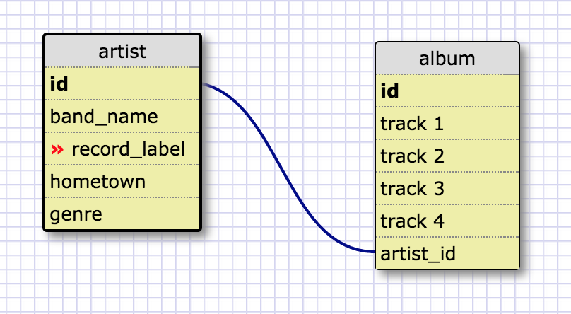
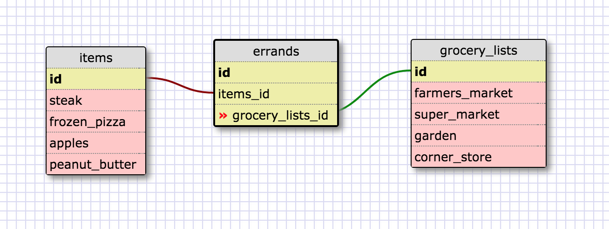

What is a one-to-one database?

This is a relationship exclusively between two rows on separate tables.  The rows can not share with any other row.

When would you use a one-to-one database? (Think generally, not in terms of the example you created).

A one-to-one database is useful for additional information on the subject of a parent table.  This child table may have more details or possibly restricted information.
W
hat is a many-to-many database?
This has multiple rows from one table pointing to rows in another table.  This second table can also have pointers back to the first table but to different rows.

When would you use a many-to-many database? (Think generally, not in terms of the example you created).

Whenever you have two or more tables that might share info.

I understand how to fill a join table now but am still unsure how they are accessed or what the methodology is.